  &nbsp;&nbsp;&nbsp;

## 🧠 Stack & Tools

  
  
  
  
  
  
  
  
  
  
  
  
  

## ⚡ What I'm focused on

- Data cleaning, EDA and visualization the right way (not just vibes)
- Clean SQL — window functions, CTEs, query optimization
- Building ETL pipelines with Python + PostgreSQL
- Writing code that doesn't make future-me cry
- Cloud fundamentals (AWS / GCP)
- Interactive Dashboards - both pretty and insightful
- Data Engineering: Airflow, dbt, batch vs. stream processing

## 🌱 Want to Learn

- Apache Spark for large-scale data
- Electron for building desktop apps (fun side quest)
- Backend development so my frontend isn't lonely
- Software engineering basics — clean code, design patterns, testing
- Real-time Streaming (Kafka / Flink) — to power live telemetry data on the fly
- Cybersecurity — how easily things break

## 📁 Projects

**✅ Shipped (with room to grow)**

- **[Collection Site](https://github.com/aceumlol/coll-site)** — Next.js/Tailwind dashboard with an automated pipeline for importing messy sheets into Supabase
- **[Bookie Audit](https://github.com/aceumlol/bookie-audit)** — Market efficiency audit of Bet365 Football odds data
- **[LOL Ranked Fatigue](https://github.com/aceumlol/ranked-fatigue-analysis)** — How fatigue and session length affect high-elo League of Legends performance

**🗂️ TODO**

- **LOL Accounts Storage** — App to keep track of all League of Legends accounts displaying recent games/ranks (possibility to expand to other games). Login via Google (Supabase), export/import passwords, fully customizable.
- **Wordle Machine Learning** — App that uses Information Theory to calculate the mathematically optimal guesses for Wordle. Evaluate the entire dictionary to eliminate the max number of possibilities per turn.
- **LOL Live Stats** — A real-time telemetry dashboard for professional League of Legends matches. Processes live API data to instantly visualize current gamestates, gold diffs and objective control.
- **Logistics Dashboard** — Interactive  dashboard built to optimize global SCM by identifying bottlenecks and revenue leaks Visualize origin-to-destination delivery flows and mapping regional demand. Additionally, feature a risk-detection module to isolate fraud.
